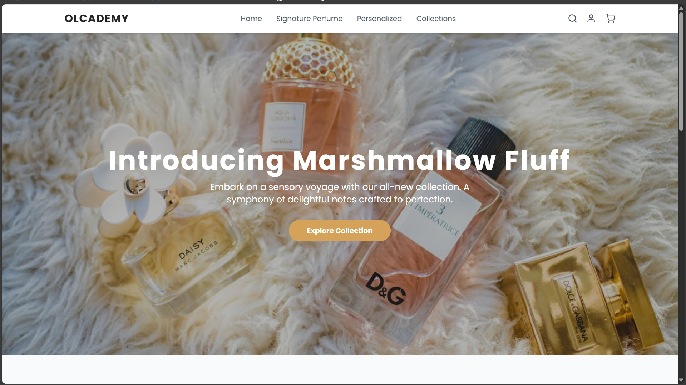
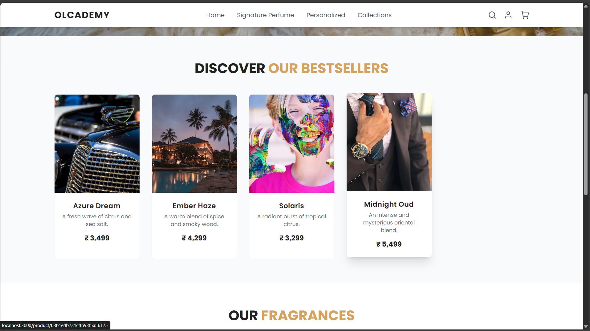
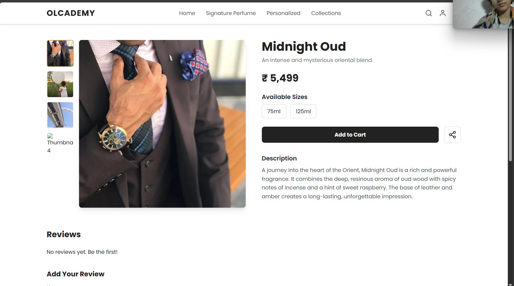

# Olcademy Internship Assignment - Full Stack Perfume Shop

This project is a complete MERN stack web application for a modern and engaging perfume shop, developed as a part of the selection process for the Web Development Internship at Olcademy.

The application is designed with a strong focus on a clean, premium user interface and a seamless user experience, drawing inspiration from high-end e-commerce designs. All data is dynamically served from a custom-built backend API.

## Key Features

### Homepage

*   **Responsive Navigation Bar:** A clean and sticky navbar that collapses into a hamburger menu on mobile devices.
    
*   **Eye-Catching Hero Banner:** A full-width call-to-action banner to attract user attention.
    
*   **Dynamic Product Cards:** A grid of best-selling products fetched directly from the database.
    
*   **Interactive Hover Effects:** Smooth animations on product cards to enhance user engagement.
    
*   **Categorization & Testimonials:** Sections to showcase fragrance types and build trust with customer testimonials.
    

### Product Page

*   **Detailed Product Information:** Dynamically loads product name, full description, price, and available sizes.
    
*   **Interactive Image Gallery:** Users can view multiple product images by clicking on thumbnails.
    
*   **Functional Reviews Section:** Users can read existing reviews and submit their own, which are then stored in the database.
    
*   **Social Sharing:** A share button that uses the Web Share API (with a clipboard fallback) to allow users to share the product link.
    

## Technical Specifications & Tech Stack

*   **Frontend:**
    
    *   **React:** For building the user interface.
        
    *   **React Router:** For client-side routing and navigation.
        
    *   **Tailwind CSS:** For a utility-first approach to create a custom, responsive design.
        
    *   **Axios:** For making HTTP requests to the backend API.
        
*   **Backend:**
    
    *   **Node.js:** As the JavaScript runtime environment.
        
    *   **Express.js:** As the web server framework for building the REST API.
        
    *   **Mongoose:** As the Object Data Modeling (ODM) library for MongoDB.
        
*   **Database:**
    
    *   **MongoDB:** A NoSQL database used to store all product and review data.
        

## How to Run This Project Locally

### Prerequisites

*   Node.js and npm installed on your machine.
    
*   A MongoDB Atlas account (or a local MongoDB instance).
    

### 1\. Backend Setup

    # 1. Navigate to the server directory
    cd server
    
    # 2. Install all required dependencies
    npm install
    
    # 3. Create a .env file in the /server directory.
    #    Copy the contents of .env.example (if provided) or add the following line:
    #    MONGO_URI="your_mongodb_connection_string_here"
    
    # 4. Seed the database with the initial mock data. This is a one-time step.
    npm run data:import
    
    # 5. Start the backend server (it will run on http://localhost:5001)
    npm run dev
    

### 2\. Frontend Setup

    # 1. Open a new terminal window and navigate to the client directory
    cd client
    
    # 2. Install all required dependencies
    npm install
    
    # 3. Start the React development server (it will open automatically at http://localhost:3000)
    npm start
    

Once both servers are running, you can access the application in your browser at `http://localhost:3000`.